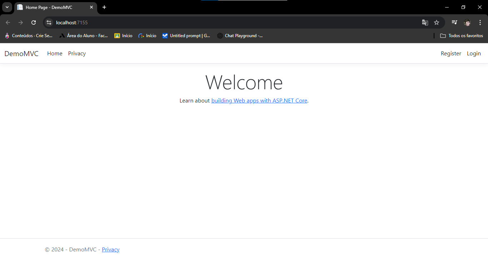

# Iniciando ASP.NET MVC
Este repositório tem como objetivo servir como um ponto de partida para quem deseja aprender 
e aplicar os principais conceitos do ASP.NET MVC, incluindo práticas essenciais como Razor Pages,
Blazor e Web API. Ao longo deste projeto, exploraremos como o padrão MVC (Model-View-Controller) pode 
ser implementado na prática, abordando a construção de interfaces dinâmicas e interativas com Razor 
Pages, além de entender o poder do Blazor para aplicações web modernas. Também veremos como criar e 
consumir APIs robustas usando ASP.NET Web API, tornando este repositório uma base sólida para o 
desenvolvimento de aplicações web completas.

<br>



<br>

## Criando uma Controller
Para criar uma controller a partir de um model nova criada(exemplo aluno.cs):
1. Clique com o botão direito do mouse na pasta "Controllers" -> add -> new scaffolded item... -> MV controller 
with views - using entity Framework.
2. Após isso selecione a model criada(nesse exemplo Aluno.cs)
3. Utilize a data do projeto utilizado
4. O nome da controler
5. Sera gerado o AlunosController.cs na pasta Controllers
6. Tambem sera criado o "CRUD" de alunos na Pasta Views

## Configurando o banco de dados após inclusão da Model
- Sera necessário rodar no terminal(Package Manager Console) o comando 
para fazer as migrações da model Aluno:
	```bash
	Add migration Aluno

- E posteriormente para atualizar o banco de dados:
	```bash
	update-database